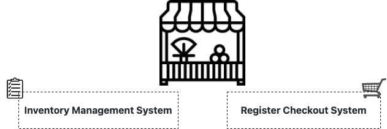

# Supermarket-Starter-Pack
## <ins> Introduction

  The Supermarket Starter Pack was designed by me as a Proof-Of-Concept (POC) project to help facilitate day to day operations in my supermarket business. The Starter Pack will contain an Inventory Management System, and Register Checkout System. The Inventory Management System can be used to keep a track of how much items we have of a certain product as well as add/remove items from the inventory. An interesting feature of this system is that it will automatically update the list to provide the latest data with every customer transaction, so you would know at any given time if any items are running out of stock. Moreover, the Register Checkout System will assist with finding the total cost of all the items in a customer’s cart, including taxes. 

__Targeted User:__ The product will be used by my Supermarket Business, this product will help facilitate our current business processes to make day to day operations more efficient so that more time can be spent on helping and developing relationships with customers. 

__Technologies:__
>  Git | Jupyter Notebook/Google Colab 

## <ins> Design
### Project Architecture

#### Inventory Management System
Description

#### Register Checkout System
Description

  
## <ins> Product Usage

Description
  

## <ins> Improvements
- Description
