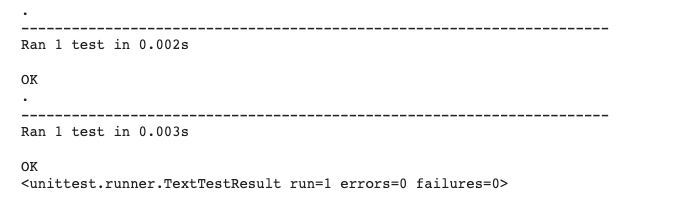
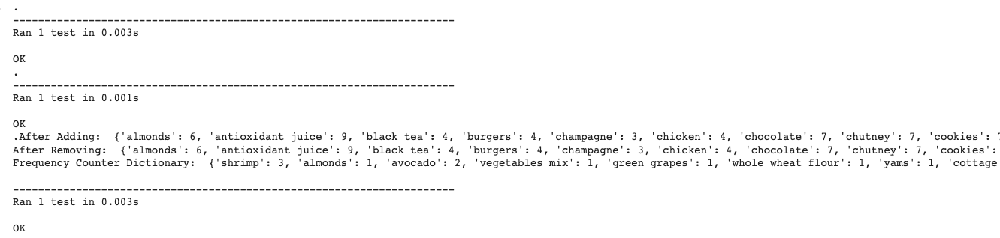

# Supermarket-Starter-Pack
## <ins> Introduction

The Supermarket Starter Pack was designed by me as a Proof-Of-Concept (POC) project to help facilitate day to day operations in my supermarket business. The Starter Pack will contain an Inventory Management System, and Register Checkout System. The Inventory Management System can be used to keep a track of how much items we have of a certain product as well as add/remove items from the inventory. An interesting feature of this system is that it will automatically update the list to provide the latest data with every customer transaction, so you would know at any given time if any items are running out of stock. Moreover, the Register Checkout System will assist with finding the total cost of all the items in a customer’s cart, including taxes. 

__Targeted User:__ The product will be used by my Supermarket Business, this product will help facilitate our current business processes to make day to day operations more efficient so that more time can be spent on helping and developing relationships with customers. 

__Technologies:__
>  Git | Python | Unit Testing | Jupyter Notebook/Google Colab 

## <ins> Design
### Project Architecture

#### Register Checkout System
The Register Checkout System will assist with finding the total cost of all the items in a customer’s cart, including taxes.

| Functions         | Description |
|-------------------|-----------|
| `transaction_no(trans_num)`      |  This function will help the Admin find the required transaction from transaction_data and return the list containing all the items from the transaction |
| `total_cost_before_tax(trans_num)`  | This function will return the number of items present in any transaction        |
| `find_total_with_tax(trans_num)`    | This Function should be able to find the final price of any transaction after Taxes have been implemented         |

#### Inventory Management System
The Inventory Management System can be used to keep a track of how much items we have of a certain product as well as add/remove items from the inventory.

| Functions         | Description |
|-------------------|-----------|
| `add_item(name, price)`    |  This function should be able to add an item to the Cost dictionary / item_dict |
| `remove_item(name)`  | This function should be able to remove an item from the Cost dictionary / item_dict       |
| `frequency_counter(flag)`    | This Function will create a Frequency Counter to count the number of items       |
| `update_counter(flag)`    |  This Function will automatically update the Frequency Counter in the case any New Transactions are made      |

## <ins> Product Usage

This section will be updated with Version 2.0 release, currently planning to use Docker/Bash Scripts to execute this project

## <ins> Testing

Unit Testing was done on both modules, all the tests ran successfully indicating that the code worked as intended.

#### Register Checkout System

#### Inventory Management System

## <ins> Improvements
- Learn Docker/Bash Scripts so that I can transform and deploy this code so that the manager at my business can install the product onto their computer and utilize this
- Create a GUI so that it might be easier to use this product
- Create an alerts system so that the manager can get an alert if the stock of an item in the inventory falls below 2 items 
